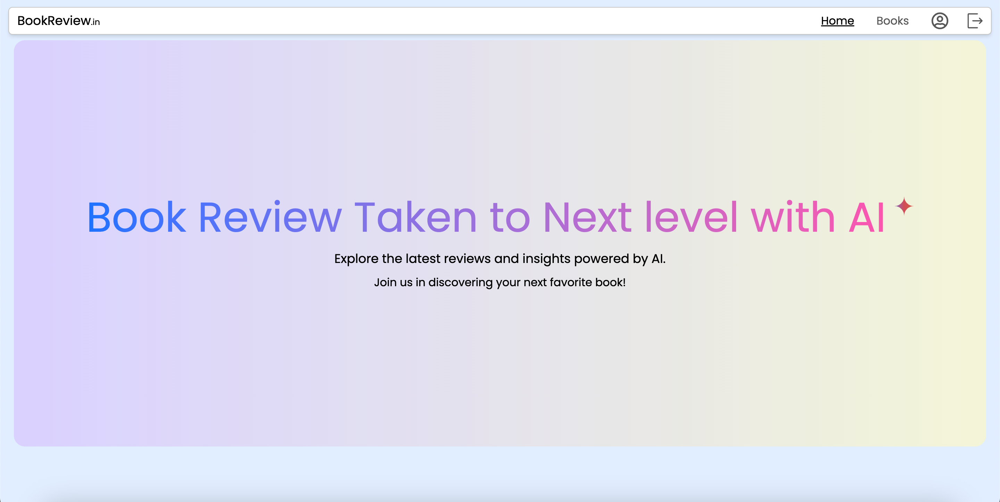
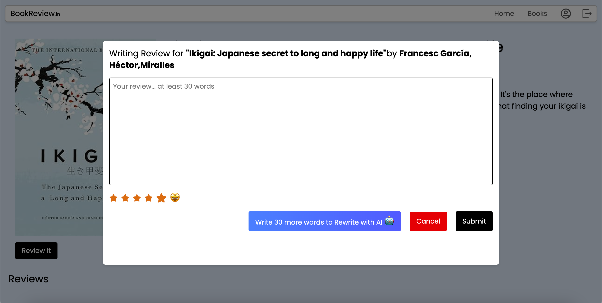
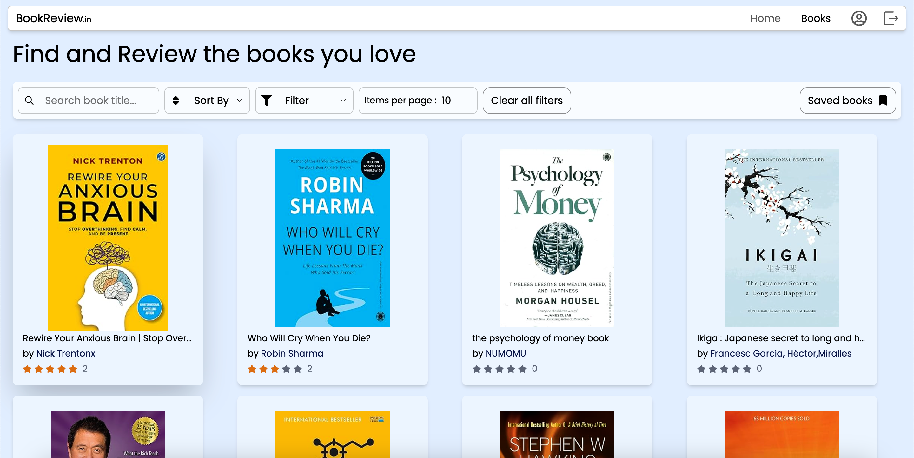

<h1 align="center">📖 BookReview</h1> <p align="center">   <a href="https://bookreview.donaldreddy.me">  </a> </p> <p align="center">     </p>


**BookReview** is an AI-powered web application that helps users discover, rate, and review books with ease. Featuring an intuitive user interface, intelligent search and filter functionality, and AI-generated review suggestions via OpenRouter, it enhances the reading experience for the digital age.

🔗 **Live Demo:** [https://bookreview.donaldreddy.me](https://bookreview.donaldreddy.me)

---

## 🖼️ Preview

| Home Page | Review Page | Book Cards |
|-----------|-------------|------------|
|  |  |  |

> 📌 *Screenshots reflect the latest UI after improvements.*


---

## 💡 Features

- 🧠 **AI-Assisted Reviews**  
  Integrated with **OpenRouter** to help generate intelligent, context-aware review suggestions.

- 🔍 **Search and Filter**  
  Search books by title, author, or keywords. Filter results dynamically to find books efficiently.

- 🧾 **Ratings & Reviews**  
  Leave star ratings and text reviews for books. Each review is linked to a user profile and is editable.

- 🔐 **User Authentication**  
  Secure login/signup using **JWT (JSON Web Tokens)** to ensure protected access and sessions.

- 👤 **User Profiles**  
  Users can view, edit, and manage their profile data from a dedicated profile page.

- 📚 **Book Listing**  
  Browse all books in a responsive, card-based layout with detailed information.

---

## 🛠️ **Tech Stack**

| Tech             | Role                        |
|------------------|-----------------------------|
| React.js         | Frontend UI                 |
| Tailwind CSS     | Styling & layout            |
| Node.js & Express| Backend APIs                |
| MongoDB          | Database                    |
| JWT              | Authentication              |
| OpenRouter      | AI-generated review content |
| Render           | Deployment platform         |

---

## 📂 **Project Structure**

```
BookReview/
├── .github/                # GitHub workflows and configs
├── Backend/                # Backend (Express.js + Prisma)
│   ├── controller/         # Request handlers
│   ├── database/           # DB connection logic
│   ├── middleware/         # Auth and error handling
│   ├── prisma/             # Prisma schema and migrations
│   ├── repository/         # DB query logic (e.g., books, users)
│   ├── routes/             # API route definitions
│   ├── service/            # Business logic
│   ├── utils/              # Helper functions
│   ├── .env.example        # Sample environment variables
│   ├── index.js            # Entry point for the server
│   ├── package.json        # Backend dependencies
│   └── package-lock.json
├── Frontend/               # Frontend (React + Tailwind)
│   ├── public/             # Static assets
│   ├── src/                # Main React source code
│   ├── .env.example        # Sample frontend env file
│   ├── eslint.config.js    # ESLint configuration
│   ├── package.json        # Frontend dependencies
│   ├── package-lock.json
│   ├── tsconfig.json       # TypeScript config
│   ├── tsconfig.app.json
│   ├── tsconfig.node.json
│   └── vite.config.ts      # Vite bundler config
├── .gitignore              # Ignore rules
├── CODE_OF_CONDUCT.md      # Contributor behavior rules
├── CONTRIBUTION.md         # Contribution guide
├── README.md               # Main project documentation
└── installation.md         # Local setup instructions

```

---

## 🛠️ **Installation**

To get this project up and running locally, follow the steps outlined in the Installation Guide. It includes everything from cloning the repository to setting up environment variables and running the development server.

🔗 [Installation Guide](./installation.md)

---

## 🤝 **Contribution**

We welcome all contributions — from design tweaks to major features. Please follow our guidelines for coding style and pull requests.

🔗 [Contribution Guidelines](./CONTRIBUTION.md)

---

## 📜 Code of Conduct

To foster an open and welcoming environment, we follow a strict [Code of Conduct](./CODE_OF_CONDUCT.md).

We expect all participants — contributors, maintainers, and users — to act with respect and integrity in all interactions.  
Harassment, discrimination, or any form of abusive behavior will not be tolerated.

By participating in this project, you agree to uphold these standards and help maintain a positive, inclusive space for everyone.

> 🙏 Please read the full [Code of Conduct](./CODE_OF_CONDUCT.md) before contributing.

---

## ✨ **AI Integration**

This app uses **OpenRouter** to assist users while writing reviews. Users can click a button during review entry to generate suggestions or summaries using AI.

---

## 🚧 **In Progress / Upcoming Features**

These features are currently being developed or planned:

- 🌓 **Dark/Light Mode Toggle** *(In Progress)*  
  Enable theme switching for improved accessibility and user preference.

- 🪟 **Toast Notifications** *(In Progress)*  
  Display real-time feedback messages (e.g., login success, errors, actions) using toast alerts.

- ❌ **Custom 404 Page** *(In Progress)*  
  Design and implement a user-friendly “Page Not Found” screen for invalid routes.

- 🎨 **UI Standardization** *(Ongoing)*  
  Improve layout consistency, spacing, and font styles across the site for a unified user experience.

---

## 🚀 **GirlScript Summer of Code (GSSoC) 2025**

This project is proudly participating in **GirlScript Summer of Code 2025**! 🎉  
We're excited to welcome contributors of all experience levels — whether you're a beginner or a seasoned developer.

🛠️ You can contribute in many ways:
- Fixing open issues and bugs
- Enhancing the UI/UX design
- Adding new features
- Refactoring or optimizing code

💬 Have an idea or question? Open an issue or join the discussion — we’re happy to help you get started.

> 🙌 First-time contributors are especially welcome, feel free to explore the project!

---

**Project by [DonaldReddy](https://github.com/DonaldReddy)** 💻

---
## ✨ Contributors
**Thank you to these amazing people.**

<a href="https://github.com/DonaldReddy/BookReview/graphs/contributors">
  
</a>
